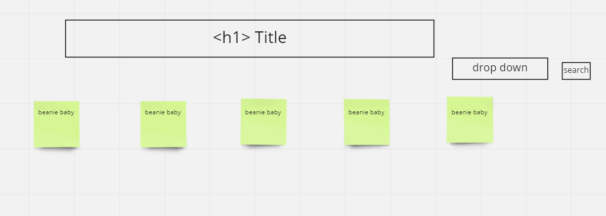

# Precious Beanie Babies

    -Web app that lets you sort beanie babies by astrological sign

## Make a plan

-   build out HTML
-   light CSS - general layout of what the final product will look like
-   JAVASCRIPT
    -Fetch functions first and the console log to make sure everything is working.
    -Render functions and then display functions and event listeners.
    ​

## HTML elements (stuff present upon page load)

h1
script
ul
input
button

## State (everything you need to track internally using JS variables)

-   array of babies (beanie variety)
-   array of horoscope signs
    ​

## Events (anything that happens via JS when the user interacts with your site)

-   on page load:

    -   fetch beanie baby list
    -   pass list to display function

-   on astrology sign form submit:
    -   fetch beanie baby list filtered by astrological sign
    -   pass list to display function

## Functions (to plan out how you'll segment things)

### Render Functions

-   `renderBabyElement` - returns HTML box for each individual beanie baby
-   `renderAstroOption` - returns HTML option for astrological sign dropdown menu

### Display Functions

-   `displayBabies(sign)` - fetches, renders and displays all babies with sign `sign`
-   `displaySignOption` - fetches, renders and adds to dropdown all astrological signs in database

### Fetch Functions

-   `fetchBabies(sign)` - fetches list of babies with sign `sign` if no sign provided, fetch all babies
-   `fetchSigns` - fetches list of astrological signs from database
    ​

## Slices (list of features that need to be written in order, usually bc each one depends on the previous)

1. Write `fetchBabies` function `renderBabies`, test.
2. Write `displayBabies()` without `sign` filtering capability, test.
3. Write `fetchSigns` function as well as the `renderAstroOption`, test.
4. Write `displaySignOption`, event listener for the drop down menu, test.
